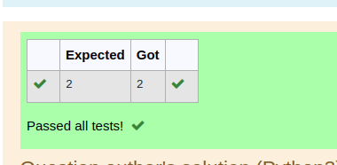

# RANK-OF-A-MATRIX
## Aim:
To write a python program to find the rank of a matrix
## Equipment’s required:
1. 	Hardware – PCs
2. 	Anaconda – Python 3.7 Installation / Moodle-Code Runner
## Algorithm:
### Step 1: 
Import the numpy module to use the built-in functions for calculation
### Step 2: 
 Assign the lists in np.array()
### Step 3:

 Using the np.linalg.matrix_rank(), we can find the rank of the given matrix.

### Step 4: 
end the program
## Program:
```
#Program to find the rank of a matrix.
#Developed by: Akshayaa M
#RegisterNumber:22008405
import numpy as np
A=np.array([[3,2,5],[1,1,2],[3,3,6]])
sol=np.linalg.matrix_rank(A)
print(sol)
```
## Output:


## Result:

Thus the rank for the given matrix is successfully solved by  using a python program.

